<h1 align="center">
  
</h1>

  
  

  

---

### ⚡ About Me

- 🔭 **Current Focus:** Developing low-level security scripts and networking utilities.
- 🌱 **Learning:** Advanced kernel exploitation, network packet manipulation, and custom CLI architecture.
- 💬 **Ask me about:** C/C++, Python automation, Linux bash scripting, and packet analysis.
- 🛡️ **Interests:** Offensive security, reverse engineering, and system internals.
- 📬 **Contact:** Reach out directly at `support@zonicisalive.com`.

---

### 🛠 Tech Stack & Tools

**Programming & Scripting**

**Security & Analysis**

**DevOps & Tools**

---

### 🐍 Contribution Snake

<picture>
  <source media="(prefers-color-scheme: dark)" srcset="https://raw.githubusercontent.com/ZonicExists/ZonicExists/output/github-snake-dark.svg">
  <source media="(prefers-color-scheme: light)" srcset="https://raw.githubusercontent.com/ZonicExists/ZonicExists/output/github-snake.svg">
  
</picture>

---

### 📊 GitHub Activity & Statistics

  

  

 

---

### 🏆 GitHub Trophies

  

---

### 🌐 Connect With Me

  

---

  

